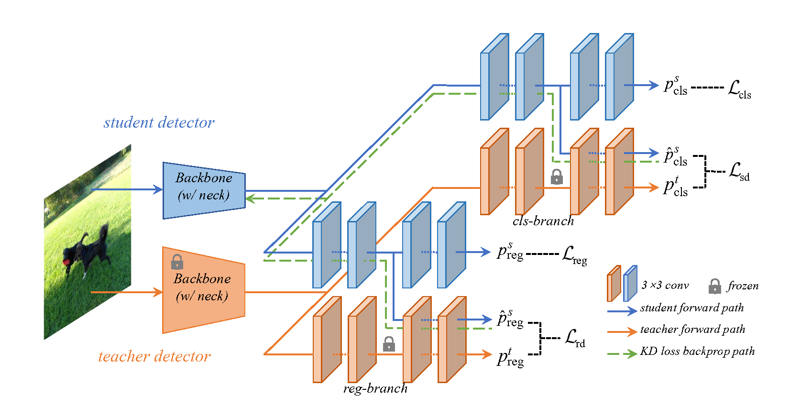

# <p align=center>  🌟 `CrossKD: Cross-Head Knowledge Distillation for Dense Object Detection` 🌟 </p>

 

This repository contains the official implementation of the following paper:

> **CrossKD: Cross-Head Knowledge Distillation for Dense Object Detection**<br>
> [Jiabao Wang](https://scholar.google.co.uk/citations?hl=en&user=S9ErhhEAAAAJ)<sup>\*</sup>, [Yuming Chen](https://github.com/FishAndWasabi/)<sup>\*</sup>, [Zhaohui Zheng](https://scholar.google.co.uk/citations?hl=en&user=0X71NDYAAAAJ)，[Xiang Li](http://implus.github.io/), [Ming-Ming Cheng](https://mmcheng.net/cmm), [Qibin Hou](https://houqb.github.io/)<sup>\*</sup>  <br>
> (\* denotes equal contribution) <br>
> VCIP, School of Computer Science, Nankai University <br>

[[Arxiv Paper](https://arxiv.org/abs/2306.11369)]

## Introduction

Knowledge Distillation (KD) has been validated as an effective model compression technique for learning compact object detectors. Existing state-of-the-art KD methods for object detection are mostly based on feature imitation, which is generally observed to be better than prediction mimicking. In this paper, we show that the inconsistency of the optimization objectives between the ground-truth signals and distillation targets is the key reason for the inefficiency of prediction mimicking. To alleviate this issue, we present a simple yet effective distillation scheme, termed CrossKD, which delivers the intermediate features of the student's detection head to the teacher's detection head. The resulting cross-head predictions are then forced to mimic the teacher's predictions. Such a distillation manner relieves the student's head from receiving contradictory supervision signals from the ground-truth annotations and the teacher's predictions, greatly improving the student's detection performance. On MS COCO, with only prediction mimicking losses applied, our CrossKD boosts the average precision of GFL ResNet-50 with 1x training schedule from 40.2 to 43.7, outperforming all existing KD methods for object detection.



## Get Started

### 1. Prerequisites

**Dependencies**

- Ubuntu >= 20.04
- CUDA >= 11.3
- pytorch==1.12.1
- torchvision=0.13.1
- mmcv==2.0.0rc4
- mmengine==0.7.3

Our implementation based on MMDetection==3.0.0rc6. For more information about installation, please see the [official instructions](https://mmdetection.readthedocs.io/en/3.x/).

**Step 0.** Create Conda Environment

```shell
conda create --name openmmlab python=3.8 -y
conda activate openmmlab
```

**Step 1.** Install [Pytorch](https://pytorch.org)

```shell
conda install pytorch==1.12.1 torchvision==0.13.1 torchaudio==0.12.1 cudatoolkit=11.3 -c pytorch
```

**Step 2.** Install [MMEngine](https://github.com/open-mmlab/mmengine) and [MMCV](https://github.com/open-mmlab/mmcv) using [MIM](https://github.com/open-mmlab/mim).

```shell
pip install -U openmim
mim install "mmengine==0.7.3"
mim install "mmcv==2.0.0rc4"
```

**Step 3.** Install [CrossKD](https://github.com/jbwang1997/CrossKD.git).

```shell
git clone https://github.com/jbwang1997/CrossKD
cd CrossKD
pip install -v -e .
# "-v" means verbose, or more output
# "-e" means installing a project in editable mode,
# thus any local modifications made to the code will take effect without reinstallation.
```

**Step 4.** Prepare dataset follow the [official instructions](https://mmdetection.readthedocs.io/en/3.x/user_guides/dataset_prepare.html).


### 2. Training

**Single GPU**

```shell
python tools/train.py configs/crosskd/${CONFIG_FILE} [optional arguments]
```

**Multi GPU**

```shell
CUDA_VISIBLE_DEVICES=x,x,x,x python tools/dist_train.sh \
    configs/crosskd/${CONFIG_FILE} ${GPU_NUM} [optional arguments]
```

### 3. Evaluation

```shell
python tools/test.py configs/crosskd/${CONFIG_FILE} ${CHECKPOINT_FILE}
```

## Results

### 1. GFL

| **Method**         | schedule | AP          | Config                                                                           | Download                                                                                                                                             |
|:------------------:|:--------:|:-----------:|:--------------------------------------------------------------------------------:|:----------------------------------------------------------------------------------------------------------------------------------------------------:|
| **GFL-Res101 (T)** | 2x+ms    | 44.9        |  [config](<configs/gfl/gfl_r101_fpn_ms-2x_coco.py>)                              |  [model](https://download.openmmlab.com/mmdetection/v2.0/gfl/gfl_r101_fpn_mstrain_2x_coco/gfl_r101_fpn_mstrain_2x_coco_20200629_200126-dd12f847.pth) |
| **GFL-Res50 (S)**  | 1x       | 40.2        |  [config](<configs/gfl/gfl_r50_fpn_1x_coco.py>)                                  |  [model](https://download.openmmlab.com/mmdetection/v2.0/gfl/gfl_r50_fpn_1x_coco/gfl_r50_fpn_1x_coco_20200629_121244-25944287.pth)                   |
| **CrossKD**        | 1x       | 43.7 (+3.5) |  [config](<configs/crosskd/crosskd_r50_gflv1_r101-2x-ms_fpn_1x_coco.py>)         |  [model](https://drive.google.com/file/d/1S7fyDkFSAauJry0ZGS-ZW-P3CJb7RlsO/view?usp=drive_link)                                                      |
| **CrossKD+PKD**    | 1x       | 43.9 (+3.7) |  [config](<configs/crosskd+pkd/crosskd+pkd_r50_gflv1_r101-2x-ms_fpn_1x_coco.py>) |  [model](https://drive.google.com/file/d/1LJZ27al2omdXb3cUty-RX37pMLp8L-4B/view?usp=drive_link)                                                      |


### 2. RetinaNet

| **Method**               | schedule | AP          | Config                                                                         | Download                                                                                                                                        |
|:------------------------:|:--------:|:-----------:|:------------------------------------------------------------------------------:|:-----------------------------------------------------------------------------------------------------------------------------------------------:|
| **RetineNet-Res101 (T)** | 2x       | 38.9        |  [config](<configs/retinanet/retinanet_r101_fpn_2x_coco.py>)                   |  [model](https://download.openmmlab.com/mmdetection/v2.0/retinanet/retinanet_r101_fpn_2x_coco/retinanet_r101_fpn_2x_coco_20200131-5560aee8.pth) |
| **RetineNet-Res50 (S)**  | 2x       | 37.4        |  [config](<configs/retinanet/retinanet_r50_fpn_2x_coco.py>)                    |  [model](https://download.openmmlab.com/mmdetection/v2.0/retinanet/retinanet_r50_fpn_2x_coco/retinanet_r50_fpn_2x_coco_20200131-fdb43119.pth)   |
| **CrossKD**              | 2x       | 39.7 (+2.3) |  [config](<configs/crosskd/crosskd_r50_retinanet_r101_fpn_2x_coco.py>)         |  [model](https://drive.google.com/file/d/1fjwtuoKd4a_b5CHf6X0tKDmSNlwzYfWb/view?usp=drive_link)                                                 |
| **CrossKD+PKD**          | 2x       | 39.8 (+2.4) |  [config](<configs/crosskd+pkd/crosskd+pkd_r50_retinanet_r101_fpn_2x_coco.py>) |  [model](https://drive.google.com/file/d/1Ha9r5DrzaZ_9tz8x9PVxOkGaKAApIBGd/view?usp=drive_link)                                                 |


### 3. FCOS

| **Method**          | schedule | AP          | Config                                                                                           | Download                                                                                                                                                                            |
|:-------------------:|:--------:|:-----------:|:------------------------------------------------------------------------------------------------:|:-----------------------------------------------------------------------------------------------------------------------------------------------------------------------------------:|
| **FCOS-Res101 (T)** | 2x+ms    | 40.8        |  [config](<configs/fcos/fcos_r101-caffe_fpn_gn-head_ms-640-800-2x_coco.py>)                      |  [model](https://download.openmmlab.com/mmdetection/v2.0/fcos/fcos_r101_caffe_fpn_gn-head_mstrain_640-800_2x_coco/fcos_r101_caffe_fpn_gn-head_mstrain_640-800_2x_coco-511424d6.pth) |
| **FCOS-Res50 (S)**  | 2x+ms    | 38.5        |  [config](<configs/fcos/fcos_r50-caffe_fpn_gn-head_ms-640-800-2x_coco.py>)                       |  [model](https://download.openmmlab.com/mmdetection/v2.0/fcos/fcos_r50_caffe_fpn_gn-head_mstrain_640-800_2x_coco/fcos_r50_caffe_fpn_gn-head_mstrain_640-800_2x_coco-d92ceeea.pth)   |
| **CrossKD**         | 2x+ms    | 41.1 (+2.6) |  [config](<configs/crosskd/crosskd_r50_fcos_r101-2x-ms_caffe_fpn_gn-head_2x_ms_coco.py>)         |  [model](https://drive.google.com/file/d/1ll5vOGFMEfOsNCkgbPuqh0uMNFnfICbE/view?usp=drive_link)                                                                                     |
| **CrossKD+PKD**     | 2x+ms    | 41.3 (+2.8) |  [config](<configs/crosskd+pkd/crosskd+pkd_r50_fcos_r101-2x-ms_caffe_fpn_gn-head_2x_ms_coco.py>) |  [model](https://drive.google.com/file/d/1r-UzxAOYOfPJFIV5e7Rd3P3uC9gXP09v/view?usp=drive_link)                                                                                     |


### 4. ATSS

| **Method**          | schedule | AP         | Config                                                                    | Download                                                                                                                       |
|:-------------------:|:--------:|:----------:|:-------------------------------------------------------------------------:|:------------------------------------------------------------------------------------------------------------------------------:|
| **ATSS-Res101 (T)** | 1x       | 41.5       |  [config](<configs/atss/atss_r101_fpn_1x_coco.py>)                        |  [model](https://download.openmmlab.com/mmdetection/v2.0/atss/atss_r101_fpn_1x_coco/atss_r101_fpn_1x_20200825-dfcadd6f.pth)    |
| **ATSS-Res50 (S)**  | 1x       | 39.4       |  [config](<configs/atss/atss_r50_fpn_1x_coco.py>)                         |  [model](https://download.openmmlab.com/mmdetection/v2.0/atss/atss_r50_fpn_1x_coco/atss_r50_fpn_1x_coco_20200209-985f7bd0.pth) |
| **CrossKD**         | 1x       | 41.8(+2.4) |  [config](<configs/crosskd/crosskd_r50_atss_r101_fpn_1x_coco.py>)         |  [model](https://drive.google.com/file/d/1qyxOMaxQrwJ20tEgIwU8pi31O8A1hsEG/view?usp=drive_link)                                |
| **CrossKD+PKD**     | 1x       | 41.8(+2.4) |  [config](<configs/crosskd+pkd/crosskd+pkd_r50_atss_r101_fpn_1x_coco.py>) |  [model](https://drive.google.com/file/d/1LkuKau1Na843ZPSNz77DqV8v8111b2_y/view?usp=drive_link)                                |


## Heterogeneous Results

### 1. Swin-Tiny

| **Method**          | schedule | AP         | Config                                                                    | Download                                                                                                                       |
|:-------------------:|:--------:|:----------:|:-------------------------------------------------------------------------:|:------------------------------------------------------------------------------------------------------------------------------:|
| **RetinaNet-SwinT (T)** | 1x       | 37.3       |  [config](<configs/retinanet/retinanet_swin-t-p4-w7_fpn_1x_coco.py>)                        |  [model](https://drive.google.com/file/d/1W2KGR77XfQ5SRomgIyxCjqUNGJichcgh/view?usp=drive_link)    |
| **RetinaNet-Res50 (S)**  | 1x       | 36.5       |  [config](<configs/atss/atss_r50_fpn_1x_coco.py>)                         |  [model](https://download.openmmlab.com/mmdetection/v2.0/retinanet/retinanet_r50_fpn_1x_coco/retinanet_r50_fpn_1x_coco_20200130-c2398f9e.pth) |
| **CrossKD**     | 1x       | 38.0 (+1.5) |  [config](<configs/crosskd+pkd/crosskd+pkd_r50_atss_r101_fpn_1x_coco.py>) |  [model](https://drive.google.com/file/d/17rbkcXgqKfVUweRgzK7NtqFcLC-PohKX/view?usp=drive_link)                                |


## Citation

If you find our repo useful for your research, please cite us:

```
@misc{wang2023crosskd,
      title={CrossKD: Cross-Head Knowledge Distillation for Dense Object Detection}, 
      author={Jiabao Wang and Yuming Chen and Zhaohui Zheng and Xiang Li and 
              Ming-Ming Cheng and Qibin Hou},
      year={2023},
      eprint={2306.11369},
      archivePrefix={arXiv},
      primaryClass={cs.CV}
}
```

This project is based on the open source codebase [MMDetection](https://github.com/open-mmlab/mmdetection).
```
@article{mmdetection,
  title   = {{MMDetection}: Open MMLab Detection Toolbox and Benchmark},
  author  = {Chen, Kai and Wang, Jiaqi and Pang, Jiangmiao and Cao, Yuhang and
             Xiong, Yu and Li, Xiaoxiao and Sun, Shuyang and Feng, Wansen and
             Liu, Ziwei and Xu, Jiarui and Zhang, Zheng and Cheng, Dazhi and
             Zhu, Chenchen and Cheng, Tianheng and Zhao, Qijie and Li, Buyu and
             Lu, Xin and Zhu, Rui and Wu, Yue and Dai, Jifeng and Wang, Jingdong
             and Shi, Jianping and Ouyang, Wanli and Loy, Chen Change and Lin, Dahua},
  journal= {arXiv preprint arXiv:1906.07155},
  year={2019}
}
```

## License

Licensed under a [Creative Commons Attribution-NonCommercial 4.0 International](https://creativecommons.org/licenses/by-nc/4.0/) for Non-commercial use only. Any commercial use should get formal permission first.

## Contact

For technical questions, please contact `jbwang@mail.nankai.edu.cn` and `chenyuming@mail.nankai.edu.cn`.

## Acknowledgement

This repo is modified from open source object detection codebase [MMDetection](https://github.com/open-mmlab/mmdetection).
